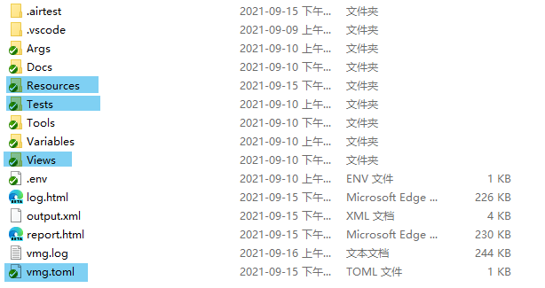
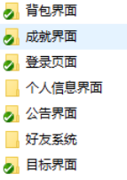
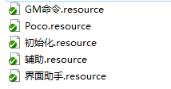
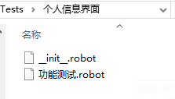
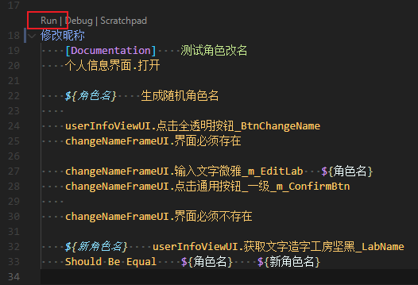
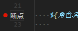

# 入门

这篇文章带领大家去了解Robotframeword-Airtest测试项目和测试脚本要如何编写。

## Robot Framework核心概念

Robotframeword-Airtest是以Robot Framework为单元测试框架为基础开发的，所有的测试脚本都是用Robot Framework的语法去编写，因此你需要了解[RobotFramework核心概念](https://robotframework-userguide-cn.readthedocs.io/zh_CN/latest/CreatingTestData/index.html)。

!!! Note 
    后面的教程将会建立在你已经了解了Robot Framework核心概念的基础上讲解，所以请务必要花点时间了解Robot Framework核心概念。
    同时我们假设你的测试项目已经在[入门](../quick_start/index.md)教程里已经配置好了。

## 项目讲解

在[入门](../quick_start/index.md)那一章，我们已经搭建好了测试项目，下面是我们测试项目的目录。



**
Tests**

用来放置我们的测试脚本。默认的规范是以模块名创建[**测试套件文件夹**][FileTestCase]，然后在这个测试套件文件夹下创建各个[**测试用例文件**][FileTestCase]。




!!! Warning
    测试套件文件夹内一定要有一个 `__init__.robot` 文件，内容默认留空，这个文件有什么用去看[**测试套件文件夹**][FileTestCase]。

**Resources**

用来存放公用资源文件（.resource），一些可以复用公用的关键字将会定义到这些资源文件里面供测试团队调用。



**Views**

用来存放前端界面资源文件，在[入门/创建项目](../quick_start/1_create_project.md)那一章已经讲过这个目录的作用了。

**vmg.toml**

界面模型导出配置文件，用来配置测试项目的界面模型导出规则。

!!! Warning
    **不是负责管理项目的人不要乱改和提交。**


## 创建你的用例

1. 在`Tests\功能测试`目录下根据你测试的模块名创建一个同名目录，比如“个人信息界面”,那么我们就创建一个名为“个人信息界面”的文件夹。
2. 在这个文件夹下面创建`__init__.robot`文本文件。
3. 然后正式创建你自己的测试用例文件，比如`功能测试.robot`



这样你就创建好了你的测试用例。

## 用例的编写

在VSCode里打开`功能测试.robot`，下面是项目默认模板：

```robotframework
*** Settings ***
Documentation    这是文档注释，会生成到报告里
Metadata    作者    dengxuan    # 这是作者注释，会生成到报告里

Resource    ../../Resources/初始化.resource    

Suite Setup    初始化.测试集通用设置        # 测试集执行的时候会调用一次“测试集通用设置”关键字
Suite Teardown    初始化.测试集通用清理    # 所有用例执行结束后，测试集会执行“测试集通用清理”关键字

Test Setup    初始化.用例通用设置    # 每个测试用例执行前会先执行“用例通用设置”
Test Teardown    初始化.用例通用清理    # 每个测试用例执行结束会执行“用例通用清理”

Resource    ../../Resources/Poco.resource   # 引入Poco.resource

*** Test Cases ***
你的测试用例
    No Operation
    ...
```

`Suite Setup` `Suite Teardown`  `Test Setup` `Test Teardown` 并非固定一定要用`初始化.resource`里的通用关键字。你可以根据自己的实际需要自己实现，但是默认的情况下通用的已经够用了。

**Poco.resource文件内容**
```robotframework
*** Settings ***
Documentation    每个项目所用的引擎不一样，所以用的PocoLibrary也不一样，把
...    PocoLibrary测试库的统一引入放到这里来统一修改，以后测试脚本中尽量引入
...    这个资源来引入项目的PocoLibrary，代替直接用Library去引用。

Library    robotframework_airtest.Poco.UnityPocoLibrary
```

`StdPocoLibrary`是通用Poco测试库，对应`StdPoco`；`UnityPocoLibrary`是Unity引擎专用Poco测试库，对应`UnityPoco`。


!!! Question
    **那我们要如何去模拟按键操作的去操作我们的界面？**

## Poco测试库使用

**Robotframework-Airtest**把**Airtest.Poco**的各个引擎的`driver`里的接口封装成了关键字作为测试库暴露给RobotFramework。

所以`StdPocoLibrary`、`UnityPocoLibrary`测试库（统称**PocoLibrary**）内置了所有**Airtest.Poco**的操作关键字，比如查找元素、点击、拖拽等等。于此同时`PocoLibrary`还实现了一些自己的关键字用来提高测试效率。

详细的关键字文档可以看页面的左下角[**接口文档**][接口文档]。

!!! Info
    所有的的关键字参数里 path 参数都兼容 str和UIObjectProxy。
    也就是说在RobotFramework里你可以如下使用：
    ```robotframework
    *** Test Cases ***
    例子
        # 直接用查询字符
        点击元素    btn_start

        # 用UIObjectProxy对象    
        ${btn_start}    获取元素    btn_start
        点击元素    ${btn_start}

        # 用界面模型变量
        点击元素    ${Panel.btn_start}
    ```

## 面向界面模型测试

Robotframework-Airtest的一个重要特性是面向界面模型测试，我们可以像调用界面接口一样去操作界面，而无需写复杂的元素查询逻辑。

!!! Question    
    **什么是界面模型资源？**

    `.resource`文件属于Robot Framework的资源文件，里面不允许有`TestCase`，但是可以有`Variables` `Keywords` 。因此被用来保存通用的变量和关键字用。
    Web自动化测试中，例如`Selemium`有一种模式叫做`PageModel`，通过将Web页面抽象成一个`PageModel`封装了页面的控件元素、功能的操作函数，以此来复用。界面模型就是参考这种设计的产物。

    而Robotfrmework-Airtest的界面模型资源是通过解析前端界面资源（比如Unity游戏的Prefab）的结构，自动生成的包含界面元素路径，界面元素操作关键字的资源。界面模型资源可以随时重新以最新的前端界面资源导出更新，而不需要总是去手动维护。

**界面模型导出**
要用界面模型首先你需要有一份界面模型资源。
在测试项目根目录（vmg.toml所在目录）命令行里输入`ra vmg`

然后你会看到工具在导出界面模型资源：
```shell
>ra vmg gen
>RobotFramework
===========================开始根据配置文件导出===========================
>开始处理 default:
vmg-INFO:解析 Views\BagView.prefab
vmg-INFO:导出Views\BagView.prefab-->Resources/界面模型\BagView.resource
vmg-INFO:解析 Views\subview\BagView.prefab
vmg-INFO:导出Views\subview\BagView.prefab-->Resources/界面模型\subview\BagView.resource
...
```

导出完毕后你就可以在Resource目录看到界面模型资源。

试着在`示例用例.robot` 中使用界面模型。

```robotframework
*** Settings ***
Resource            ../../Resources/Poco.resource
Resource            ../../Resources/初始化.resource
Resource            ../../Resources/界面模型/BagView.resource    # 导入界面模型

Suite Setup         测试集通用设置
Suite Teardown      测试集通用清理
Test Setup          用例通用设置
Test Teardown       用例通用清理


*** Test Cases ***
示例用例
    Log    Hello World!    console=True

    BagView.界面必须存在    # 断言背包界面是否存在

    元素必须存在    ${BagView.BagView_Node_SellBtn}    # 断言SellBtn存在
    BagView.点击BagView_Node_SellBtn    # 点击SellBtn
```

你可以把`BagView`视为背包界面对象，其`Variables`配合`PocoLibrary`的接口实现更复杂的逻辑，其`Keywords`则负责简单的按钮点击拖动之类的操作。

`BagView.BagView_Node_SellBtn` 就是界面模型 `BagView.resources` 中`Varialbes`的一项。

`BagView.点击BagView_Node_SellBtn` 则是`BagView_Node_SellBtn`的点击操作关键字。

## 界面模型的使用案例

!!! Warning
    由于手头没有Unity示例项目，而Airtest的Demo `com.netease.poco.u3d.tutorial.apk`我没有其Prefab文件，因此无法用用这个Demo做演示。
    
    但是我可以提供一个案例脚本。

```robotframework
*** Settings ***
Documentation    这是文档注释，会生成到报告里
Metadata    作者    kaluluosi    # 这是作者注释，会生成到报告里

Resource    ../../../Resources/初始化.resource    

Suite Setup    初始化.测试集通用设置        设置”关键字
Suite Teardown    初始化.测试集通用清理    集通用清理”关键字

Test Setup    初始化.用例通用设置    
Test Teardown    初始化.用例通用清理    

# 引入你要测试的界面模型资源
Resource    ../../../Resources/界面模型/drama/dramaChatViewUI1.resource
Resource    ../../../Resources/界面模型/drama/skipLoginDramaFrameUI.resource
Resource    ../../../Resources/界面模型/drama/skipLoginDramaAlertUI.resource
Resource    ../../../Resources/界面模型/userInfo/dramaChangeNameViewUI.resource
Resource    ../../../Resources/界面模型/userInfo/dramaChangeNameFrameUI.resource

Resource    ../../../Resources/界面模型/main/playerMsgUI.resource
Resource    ../../../Resources/界面模型/userInfo/userInfoViewUI.resource
Resource    ../../../Resources/界面模型/userInfo/changeNameFrameUI.resource

Resource    Poco.resource   # 引入Poco.resource

*** Test Cases ***
修改昵称
    ${用户名}    生成随机角色名
    登录    ${用户名}    11111    serverid=${serverid}
    
    # 登录后就要等加载结束，通过等待某个元素的消失和出现来实现
    等待元素消失    游戏状态    2 sec
    等待元素出现    游戏状态    20 sec

    # 加载结束后会弹出跳过片头提示弹窗，我们操作这个弹窗跳过片头
    skipLoginDramaFrameUI.点击片头_欢迎界面按钮_BtnConfirm
    skipLoginDramaAlertUI.点击通用按钮_一级_短_BtnConfirm

    # Robotframework-Airtest的另一个机制，界面观察者机制，后面会单独细讲
    # dramaChatViewUI1是个剧情对话框，当发现这个界面出现的时候就点击屏幕下方推进对话
    监控UI    如果 dramaChatViewUI1.界面存在 那么 点击屏幕下方

    # 跳过片头
    skipLoginDramaFrameUI.点击片头_欢迎界面按钮_BtnConfirm
    skipLoginDramaAlertUI.点击通用按钮_一级_短_BtnConfirm

    # 再次等待加载
    等待元素消失    游戏状态    2 sec
    等待元素出现    游戏状态    20 sec

    等待元素出现    原画层    20 sec
    循环 点击屏幕中间 直到 原画层消失

    # 开始处理起名流程
    等待元素出现    ${dramaChangeNameViewUI}    120
    dramaChangeNameViewUI.点击剧情改名_名字框_ImageChangeName
    dramaChangeNameFrameUI.界面必须存在

    dramaChangeNameFrameUI.点击个人信息_改名随机按钮_BtnRoll
    dramaChangeNameFrameUI.输入文字微雅_LabelEdit    ${角色名}
    dramaChangeNameFrameUI.点击通用按钮_一级_BtnConfirm

    # 等待主UI出现
    等待元素出现    ${mainFunEntranceMenu.主界面1121_手机主体_ImageRightdown1}    20 sec

    # 然后屏蔽新手引导
    调用GM命令    屏蔽新手引导

    # 等待弹窗消失
    等待元素消失     nameMatches=other/.*    time_out=10 sec

    # 取消掉对话框的监控处理
    取消监控UI    如果 dramaChatViewUI1.界面存在 那么 点击屏幕下方
```
写到这里你可能会发现这个用例十分的长，但是你仔细观察你会发现其实这些操作步骤里面有部分操作步骤是可以抽离写成关键字供所有人一起用的，比如登录、等待加载、包括整个创角流程。

为了以后方便，我们应该把公有的操作封装成关键字。还记的**Resources目录**吗？这个目录下面就有一些资源文件，这些资源文件就是供我们定义公用关键字用的。

### 剥离通用逻辑

打开`辅助.resource`

```robotframework

*** Settings ***
Documentation    这是个辅助Resource，主要用来定义一些通用的辅助关键字，比如自动创角

Resource    Poco.resource
Resource    GM命令.resource

Resource    界面模型/drama/dramaChatViewUI1.resource
Resource    界面模型/drama/skipLoginDramaFrameUI.resource
Resource    界面模型/drama/skipLoginDramaAlertUI.resource
Resource    界面模型/userInfo/dramaChangeNameViewUI.resource
Resource    界面模型/userInfo/dramaChangeNameFrameUI.resource
Resource    界面模型/main/mainFunEntranceMenu.resource
Resource    界面模型/popup/popupCountFrameUI.resource
Resource    界面模型/achieve/achieveFinishTipsUI.resource

*** Keywords ***


自动创角
    [Documentation]    自动创角自动流程，负责帮忙处理登录-》创角-》进入主界面 一整个流程
    ...    但是具体的创角自动化操作流程需要自己实现，毕竟每个游戏的创角流程都不一样。
    ...    这个关键字前半部分生成随机角色名到登录这部分是通用的，往后就是登录到游戏里的创角
    ...    流程，自己实现吧。
    ${用户名}    生成随机角色名
    登录    ${用户名}   password=11111    serverid=${serverid}
    等待加载

    监控UI    如果 dramaChatViewUI1.界面存在 那么 点击屏幕下方

    跳过片头
    等待加载
    等待元素出现    原画层    20 sec
    循环 点击屏幕中间 直到 原画层消失
    
    处理起名流程    ${用户名}
    
    等待元素出现    ${mainFunEntranceMenu.主界面1121_手机主体_ImageRightdown1}    20 sec
    GM命令.屏蔽新手引导
    
    等待元素消失     nameMatches=other/.*    time_out=10 sec

    取消监控UI    如果 dramaChatViewUI1.界面存在 那么 点击屏幕下方

原画层消失
    ${结果}    元素不存在    原画层
    [Return]    ${结果}

跳过片头
    skipLoginDramaFrameUI.点击片头_欢迎界面按钮_BtnConfirm
    skipLoginDramaAlertUI.点击通用按钮_一级_短_BtnConfirm

处理起名流程
    [Arguments]    ${角色名}
    等待元素出现    ${dramaChangeNameViewUI}    120
    dramaChangeNameViewUI.点击剧情改名_名字框_ImageChangeName
    dramaChangeNameFrameUI.界面必须存在

    dramaChangeNameFrameUI.点击个人信息_改名随机按钮_BtnRoll
    dramaChangeNameFrameUI.输入文字微雅_LabelEdit    ${角色名}
    dramaChangeNameFrameUI.点击通用按钮_一级_BtnConfirm

等待加载
    [Documentation]    等待场景加载完毕
    ...    这个关键字也是需要自己根据项目实现，实现的方式也很简单，用等待元素出现和等待元素消失
    ...    来等待加载界面（界面模型），的出现和消失。如果超时没等到这个关键字就会失败导致整个测试失败。
    等待元素消失    游戏状态    2 sec
    等待元素出现    游戏状态    20 sec


点击屏幕中间
    点击屏幕

点击屏幕下方
    点击屏幕    (0.5, 0.8)

点击屏幕上方
    点击屏幕  (0.5, 0.1)
```

把`屏蔽新手引导`封装成关键字放到`GM命令.resource`里。
```robotframework

*** Settings ***
Documentation    GM命令的封装。原始的发送GM命令关键字语义太差，把常用的GM命令和复杂的GM命令封装好放到这里大家一起用会更好维护。
...    例如：添加道具，发送完GM命令后会有一大堆的奖励弹窗要清理，可以一起封装到添加道具关键字里处理干净后，那么以后调用这个关键字的
...    同事就不用重新写一段逻辑去处理弹窗了。
...    Poco的调用GM命令关键字支持以下几种方式：
...    调用GM命令    设置金币数量    Money    1000    根据GM配置表里的名字调用，基本上就是等同点了GM面板上的按钮了
...    调用GM命令    $set    Money    1000        就跟在聊天栏里发送指令一样，这是服务端指令
...    调用GM命令    /ftask                       这是客户端指令

Resource    Poco.resource


*** Keywords ***

屏蔽新手引导
    调用GM命令    屏蔽新手引导

```

回到我们的的`功能测试.robot`，

```robotframework

*** Settings ***
Documentation    这是文档注释，会生成到报告里
Metadata    作者    dengxuan    # 这是作者注释，会生成到报告里

Resource    ../../../Resources/初始化.resource    

Suite Setup    初始化.测试集通用设置        设置”关键字
Suite Teardown    初始化.测试集通用清理    集通用清理”关键字

Test Setup    初始化.用例通用设置    
Test Teardown    初始化.用例通用清理    

Resource    Poco.resource  
Resource    ../../../../Resources/辅助.resource    # 引入我们的辅助.resource

*** Test Cases ***
修改昵称
    辅助.自动创角
```

瞬间用例就清爽了很多，之前为了实现创角流程引入的界面模型资源也可以删掉了。

接下来就是实现我们的个人信息界面修改昵称的测试流程

### 个人信息界面修改昵称的测试流程

这部分就很简单了，照着测试用例的步骤点

```robotframework

*** Test Cases ***
修改昵称
    辅助.自动创角

    ${角色名}    生成随机角色名
    
    # 打开个人信息界面
    playerMsgUI.点击主界面H_玩家信息背景_RoleMsgPnl

    userInfoViewUI.点击全透明按钮_BtnChangeName
    changeNameFrameUI.界面必须存在    # 这是界面模型内置的断言，如果失败了那么测试就失败

    changeNameFrameUI.输入文字微雅_m_EditLab   ${角色名}
    changeNameFrameUI.点击通用按钮_一级_m_ConfirmBtn
    changeNameFrameUI.界面必须不存在    # 这是界面模型内置的断言，如果失败了那么测试就失败

    # 最后做个预期结果的断言
    ${新角色名}    userInfoViewUI.获取文字造字工房坚黑_LabName
    Should Be Equal    ${角色名}    ${新角色名}     界面上的角色名一定要跟修改的角色名一致
```


## 执行/调试用例

RobotFramework-lsp插件会识别robot文件并在每个用例名称上面显示三个按钮，分别是执行、调试、交互式窗口调试。

!!! Warning
    交互式窗口（Scraptchpad）基本是会失败的，因为我们的测试脚本很多都依赖了Poco，而Poco必须要连接设备才能工作，交互式窗口不会走`TestSetup` `SuitSetup` `测试集通用设置`帮你连接设备。

执行你的用例




RobotFramework Language Server 支持断点调试，你可以打个断点然后点击`Debug`按钮这样跑到断点的位置时候会停止，你可以在这时候去通过VSCode的调试窗口或者调试控制台来查看当前堆栈的变量值。

## 调试日志和报告


```shell
...
示例                                                                  | PASS |
1 test, 1 passed, 0 failed
==============================================================================
Output:  C:\Users\...\robotframework-airtest\sample\output.xml
Log:     C:\Users\...\robotframework-airtest\sample\log.html
Report:  C:\Users\...\robotframework-airtest\sample\report.html
```
控制台打印的最后三行是本次执行的日志和报告，你可以点击打开查看。


<!-- 链接引用 -->
[DirTestSuit]:https://robotframework-userguide-cn.readthedocs.io/zh_CN/latest/CreatingTestData/CreatingTestSuites.html#id8

[FileTestCase]:https://robotframework-userguide-cn.readthedocs.io/zh_CN/latest/CreatingTestData/CreatingTestSuites.html#id7

[接口文档]:../libs/index.md

