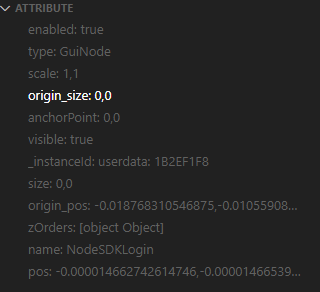
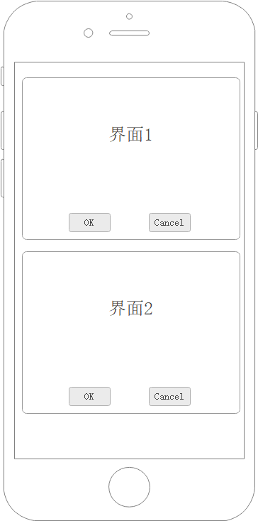

# 中级

这篇文章会一一讲解Robotframework-Airtest特性和特有关键字。

## PocoLibrary查询语句 PocoUrl

PocoLibrary提供的元素操作相关关键字基本都带有`target`和`**attrs`参数。这两个参数是用来查询元素用的。我们拿`获取元素`这个关键字说明一下。

!!! Note
    `获取元素`是PocoLibrary最基础的关键字，其他关键字几乎都有调用`获取元素`，所以你总能在其他PocoLibrary的关键字里看到`target`和`**attrs`参数这两个参数。

```
获取元素(target: PocoUrl|UIObjectProxy | None = None, **attrs)
查询获取元素

Args: target (Union[PocoUrl,UIObjectProxy], optional): 查询路径. Defaults to None.
Returns: UIObjectProxy: 返回的元素对象
```

!!! Tip
    `PocoUrl`其实就是`str`类型的别名，源码中是这么定义的：
    ```python
    PocoUrl = str
    ```
    之所以取个别名是为了凸显这个字符串是`Url`格式的字符串。

PocoLibrary扩展了Poco的查询语句,让`target`参数支持url风格查询参数，格式如下：
```shell
[元素名][?属性名1=属性值1[&属性名2=属性值2]...]
```

属性名是你从AirtestIDE上查看到的元素的属性列表中的名字。




下面看看其用法

### 普通用法

用来查找某个名字的元素，只写元素名即可

```robotframework
*** Test Cases ***
普通用法
    # 直接用元素名查询
    ${btn_start}    获取元素    btn_start
 
    # 用UIObjectProxy对象    
    ${btn_start}    获取元素    btn_start
    点击元素    ${btn_start}

    # 用界面模型变量
    点击元素    ${Panel.btn_start}
```

等同于Poco的：
```python
btn_start = poco("btn_start")
```

### 高级用法

```robotframework
*** Test Cases ***
高级用法
    # 带参查询
    ${btn_start}    获取元素    btn_start?type=Button
```

#### 带参查询 

例如我们要查找所有`enable=True`的`btn_start`元素：

```robotframework
*** Test Cases ***
高级用法
    # target带参查询
    ${btn_start}    获取元素    btn_start?enable=True
```
等同于Poco：
```python
btn_start = poco("btn_start", enable=True)
```

又或者我们想要找所有`enable=True`的元素，只要不传元素名，直接`?`号开始写查询参数即可：

```robotframework
*** Test Cases ***
高级用法
    # target带参查询
    ${btn_start}    获取元素    ?enable=True
```

等同于Poco:
```python
btn_start = poco(enable=True)
```


#### 正则匹配属性参数

Airtest.Poco的查询属性支持正则表达式匹配属性，Robotframework-Airtest也支持这个功能。
正则匹配参数的规则是：

```shell
<属性名>Matches=<正则表达式>
```
```robotframework
*** Test Cases ***
高级用法
    # 正则匹配参数查询
    ${btn_start}    获取元素    Label?textMatches=hello.*
```
这条查询的意思是找到所有 `text`属性以`hello`开头的`Label`。

等同于Poco的：
```python
btn_start = poco("Label", textMatches="hello.*")
```

#### 查询链

`target`/PocoUrl 参数支持用`\\`分割拼接多个查询语句做成查询链

```robotframework
*** Test Cases ***
高级用法
    # 带参查询
    ${btn_start}    获取元素    btn_start\\Label
```

上面的效果是获取元素会找`btn_start`，找到后接着在`btn_start`下面找`Label`。

当然你可以在查询链里面用查询参数

```robotframework
*** Test Cases ***
高级用法
    # 带参查询
    ${btn_start}    获取元素    btn_start?type=Button\\Label?text=hello
```

#### 额外查询参数

关键字的`**attrs`参数其实也是查询参数，不过此查询参数不是以字符串语句的形式而是以`键值参数（kwargs）`的方式提供。

!!! Warning
    额外查询参数**只会作用于查询链最后一个元素的查询**。

```robotframework
*** Test Cases ***
高级用法
    # 额外查询参数
    ${btn_start}    获取元素    btn_start\\label    enable=True    textMatches=start.*
```

额外查询参数最终会合并到查询链最后一个查询也就是`label`里，相当于是：

```robotframework
*** Test Cases ***
高级用法
    # 额外查询参数
    ${btn_start}    获取元素    btn_start\\label?enable=True&textMatches=start.*
```

如果最后一个查询本身也有查询参数会怎么样？

```robotframework
*** Test Cases ***
高级用法
    # 额外查询参数
    ${btn_start}    获取元素    btn_start\\label?enable=True    textMatches=start.*
```

他会直接合并到最后一个查询，如果存在同名参数则覆盖同名参数的值。
```robotframework
*** Test Cases ***
高级用法
    # 额外查询参数
    ${btn_start}    获取元素    btn_start\\label?enable=True&textMatches=start.*
```


!!! Note
    之所以设计这个机制是因为界面模型有很多元素查询变量都是基于查询链封装，我们无法额外的调整查询参数，所以提供了`**attr`来供我们额外调整。不过实践的过程中发现基本没怎么用上这个功能，所以一直都是作为底层界面模型的支撑机制隐性存在着。


## 获取元素属性

Airtest.Poco的`UIObjectProxy`支持通过`attr()`函数获取元素的属性。

```python
poco = Poco()
btn_start = poco("btn_start")
print(btn_start.attr("type"))

# >>> Button
```

那么Robotframework-Airtest要怎么获取？

```robotframework


*** Test Cases ***
获取元素属性
    ${btn_start}    获取元素    btn_start
    Log     ${btn_start.attr("type")}
```

!!! Note
    这不是Robotframework-Airtest提供的特性，这是Robot Framework提供的高级特性[扩展变量语法](https://robotframework-userguide-cn.readthedocs.io/zh_CN/latest/CreatingTestData/Variables.html#extended-variable-syntax)。正因为这个特性，所以PocoLibrary没有实现`获取元素属性`关键字`。

!!! Note
    其实原理可以理解为 
    > 在${}内的语句其实都会被Robot Framework eval的
    
    这也是为什么你可以用`${1}`、`${True}`来创建非字符串变量。


## 同名元素列表

`获取元素`关键字返回的是一个UIObjectProxy，所以很多人会以为返回的就是**一个**元素对象，其实并不是。UIObjectProxy内部实现了`__getitem__()`方法，所以它也支持用下标索引，是个集合对象，也就是你可以这样：


```robotframework
*** Test Cases ***

访问同名元素
    ${btn_start}    获取元素    btn_start
    点击元素    ${btn_start[1]}    # 点击所有同名元素中第二个btn_start
```

!!! Tip
    `${btn_start[1]}`是[Robot Framework访问数组](https://robotframework-userguide-cn.readthedocs.io/zh_CN/latest/CreatingTestData/Variables.html#id7)的方式。


!!! Tip
    UIObjectProxy其实并不是具体的元素对象，而是一个查询，当你访问UIObjectProxy的属性或者方法的时候，UIObjectProxy会去再次查询一次。

总的来讲，你可以这么理解：
    
`获取元素`关键字返回的是所有找到的元素，你调用`点击元素关键字`之类的关键字去操作这个元素默认只会作用于第一个元素。

与此同时你也可以获取所有元素的个数

```robotframework
*** Test Cases ***

获取同名元素个数
    ${btn_start}    获取元素    btn_start
    ${个数}     Get Length    ${btn_start}
```

## 界面模型

界面模型资源是从游戏前端项目的界面资源文件导出生成的资源文件。通过[Robot Framework核心概念](https://robotframework-userguide-cn.readthedocs.io/zh_CN/latest/CreatingTestData/index.html)你可以知道`资源文件（.resource）`就是没有`Test Cases`的robot测试脚本，资源文件主要用来定义`变量（variable）`和`关键字（keyword）`然后供其他脚本引用。

界面模型资源主要生成以下几部分：

- Variables --- 这个界面所有元素的查询链，包括界面自己。
- Keywords --- 这个界面所有元素的操作关键字

```robotframework
*** Settings ***
Documentation    userInfoViewUI 界面模型文件    注意：这个文件是导出生成的不要修改。
Library    robotframework_airtest.poco.StdPocoLibrary

*** Variables ***
${userInfoViewUI}    ?nameMatches\=userInfo/userInfoViewUI.*
${userInfoViewUI.个人信息_facebook按钮_BtnFB}    ?nameMatches\=BtnFB.*
...

*** Keywords ***
点击个人信息_facebook按钮_BtnFB
    [Arguments]     ${focus}=(0.5,0.5)
    点击元素    ?nameMatches\=BtnFB.*    ${focus}
...

```

根据控件的类型`vmg`会生成各自的操作关键字。

**界面(Root)：**   

界面模型本身对应一个界面，所以界面模型默认会生成这个界面的查询变量。而关键字则会生成一个与界面同名关键字用来获取这个界面元素，然后就是2个界面存在关键字和2个界面存在断言关键字。

```robotframework
*** Variables ***
${userInfoViewUI}    ?nameMatches\=userInfo/userInfoViewUI.*
*** Keywords ***
userInfoViewUI
    [Return]    ${元素对象}
    ${元素对象}    获取元素    ?nameMatches\=userInfo/userInfoViewUI.*
界面存在
    [Return]    ${结果}
    ${结果}    元素存在    ${userInfoViewUI}
界面必须存在
    [Return]    ${结果}
    ${结果}    元素必须存在    ${userInfoViewUI}
界面不存在
    [Return]    ${结果}
    ${结果}     元素存在    ${userInfoViewUI}
    ${结果}    Evaluate    not ${结果}
界面必须不存在
    元素必须不存在    ${userInfoViewUI}
```

```{note}
下面不再贴代码而是直接用列表列出.
```

**默认：**

默认是指所有的控件类型都会生成的操作
    
- 获取元素
- 点击元素
- 长按元素

**Text：**

文本控件

- 获取文字
- 输入文字

**Input：**

输入框

- 获取文字
- 输入文字

**List：**

列表

- 获取列表项
- 获取列表项数量
- 获取列表项_索引
- 获取列表项_文本
- 点击列表项_索引
- 点击列表项_文本

## 如果 condition 那么 keyword

此关键字的行为类似`Run Keyword If`关键字，但是更符合中文语义。同时与`Run Keyword If`不一样的地方在于，`condition`支持关键字，因此你可以配合[界面模型](#界面模型)这样使用：

```robotframework

*** Test Cases ***
示例
    如果 userInfoViewUI.界面存在 那么 点击屏幕
```

平时你可以当作`Run Keyword If`来用：

```robotframework

*** Test Cases ***
示例
    ${界面存在}     userInfoViewUI.界面存在
    如果 ${界面存在} 那么 点击屏幕
```

## 循环 keyword 直到 condition_keyword

这个关键字会持续执行直到`condition_keyword`返回`True`。这个关键字更多用于清理弹窗、对话。

```robotframework

*** Keywords ***
原画层消失
    ${结果}    元素不存在    原画层
    [Return]    ${结果}

*** Test Cases ***
示例
    循环 点击屏幕 直到 原画层消失
```

## 监控UI

监控UI是Robotframework-Airteset重要特性之一，工作原理是将关键字注册到监控队列，然后每一次执行操作的前会先去遍历一遍监控队列里注册的关键字挨个执行一遍。其实就相当于是加了个钩子在每一步操作前面。监控UI主要用于对意外弹窗，或者弹窗的清理上，而且通常要跟` 如果 condition 那么 keyword` `循环 keyword 直到 condition_keyword` 这两个关键字配合使用。

例子：

```robotframework

*** Test Cases ***
示例
    监控UI    如果 dramaChatViewUI1.界面存在 那么 点击屏幕下方
```

上面这个例子效果是，我们的测试脚本调用PocoLibrary的操作去操作元素时如果`dramaChatViewUI1.界面存在`，那么就会先去`点击屏幕下方`。（dramaChatViewUI1是个剧情对话框，点击屏幕下方正好就是点到它可以跳到下一个对话）

!!! Danger
    要注意，不要在监控UI里面注册一个死循环关键字，这样会导致死循环无法结束；也不要注册一些复杂耗时的操作，不然整个测试就会跑得很慢。因此**最佳的实践**是跟` 如果 condition 那么 keyword` 或 `循环 keyword 直到 condition_keyword`配合使用。当然你也可以用你自己封装好的关键字，只要这个关键字是能够跳出就行。

**取消监控UI**

**监控UI的监控队列每一次测试用例执行结束后会自行清空，所以不存在全局的监控。** 而有时候我们只想在某一段操作流程里做监控帮我们清理意外弹窗，那么你可以在流程结束的时候手动消掉你注册的监控。

取消监控的关键字是`取消监控UI`。

例子：
```robotframework

*** Test Cases ***
示例
    监控UI    如果 dramaChatViewUI1.界面存在 那么 点击屏幕下方

    跳过演示关
    等待加载
    等待元素出现    原画层    20 sec
    循环 点击屏幕中间 直到 原画层消失

    取消监控UI    如果 dramaChatViewUI1.界面存在 那么 点击屏幕下方

    ...
```

这样在 `监控UI`和`取消监控UI`之间的操作都会帮我们清理dramaChatViewUI1，但是往后就不会帮我们清理了。


## 聚焦元素

聚焦元素关键字是为了解决界面模型同名元素查询的问题，利用的是Poco的offspring方法。界面模型的查询都是通过查询链查询，因此基本上界面内的元素都能直接从全局准确的查询到。但是有一种情况比较特殊，那就是列表内的项，又或者界面内重复实例化的prefab，这些元素都是同名的。

比如我们有一个界面：



界面1和界面2都是用同一个界面资源重复实例化出来的，因此在控件树上他们都是同名。而我们想要点击界面2的`btn_ok`。

```robotframework

*** Test Cases ***
点击OK
    点击元素    ${界面.btn_ok}

```

那么这时候会查询到2个btn_ok，默认行为就是点击第一个找到的btn_ok。

如果我们能够把查询范围收缩到界面2内，然后点击`界面.btn_ok`就好了。

聚焦元素就是为了这个而存在，我们来看看聚焦元素怎么用

```robotframework

*** Test Cases ***
点击OK
    ${所有界面}    获取元素    ${界面}

    聚焦元素    ${所有界面[1]}
    点击元素    ${界面.btn_ok}
    取消聚焦元素   
```

这样我们就用界面模型点击到了界面2的`btn_ok`了。

!!! Warning
    `聚焦元素`和`取消聚焦元素`必须成对出现，如果忘记取消聚焦元素那么PocoLibrary的全局搜索范围就会一直被限制在你聚焦的元素上，直到测试用例结束才会重置。

如果我们在`聚焦元素`和`取消聚焦元素`里面还想点击界面2以外的界面，如下

```robotframework

*** Test Cases ***
点击OK
    ${所有界面}    获取元素    ${界面}

    聚焦元素    ${所有界面[1]}
    点击元素    ${界面.btn_ok}
    点击元素    ${userInfoViewUI.btnChangeName}     # 点击界面2以外元素
    取消聚焦元素   
```

假如`userInfoViewUI.btnChangeName`是一个弹窗，他不在界面2里面，我们如上调用是找不到`userInfoViewUI.btnChangeName`的。因为在`聚焦元素`和`取消聚焦元素`之间的查询是被限制在界面2以内，而`userInfoViewUI.btnChangeName`不是界面2的孩子，所以这一行会失败。

你得先取消聚焦元素，把查询范围恢复成全局，再操作

```robotframework

*** Test Cases ***
点击OK
    ${所有界面}    获取元素    ${界面}

    聚焦元素    ${所有界面[1]}
    点击元素    ${界面.btn_ok}
    取消聚焦元素   

    点击元素    ${userInfoViewUI.btnChangeName}     # 点击界面2以外元素
```

**嵌套聚焦**

`聚焦元素`这个关键字在设计之初就支持嵌套，但是实际实践下来使用的频率极其低。

用法如下：

```robotframework

*** Test Cases ***
点击OK
    ${所有界面}    获取元素    ${界面}

    聚焦元素    ${所有界面[1]}
    
    聚焦元素    ${ItemTemplate}     # ItemTemplate是 界面里面实例化的另外一个界面模型
    点击元素    ${ItemTemplate.btnCancel}
    取消聚焦元素
    
    点击元素    ${界面.btnOK}

    取消聚焦元素   

```

当你嵌套`聚焦元素`的时候，当前聚焦的元素是最后一次你聚焦的元素。而`聚焦元素`也遵循其自身的规则——**必须聚焦当前查询范围下的元素**。`取消聚焦元素`的时候会回退到上一个聚焦过的元素，直到最后一个`取消聚焦元素`将查询范围恢复到全局。

**这种嵌套的`聚焦元素`用法有什么用呢？**

主要适用于一个界面内有从其他界面资源里生成的界面的情况。比较典型的案例就是Unity的界面了，Unity的界面经常会把复杂的子部件拆分成单独的Prefab。那么在界面模型上的表现就是主界面文件会生成一个界面模型资源，而子部件也会生成一个界面模型资源。而主界面的界面模型资源里是没有子部件的相关的查询变量和关键字的。如果同时存在多个主界面的时候，我们就需要把查询范围收缩到要操作的主界面，然后在`聚焦元素`和`取消聚焦元素`去调用子部件界面模型的变量和关键字。

!!! Note
    这听起来感觉很晕，不过没关系，一般来讲界面模型已经能搞定所有工作，很少会碰到需要用这么复杂的操作的情况。只是游戏的UI是十分灵活复杂的，Robotframework-Airtest不得不考虑给各种情况给出一个解决方案，因此才会有这个关键字的出现。

