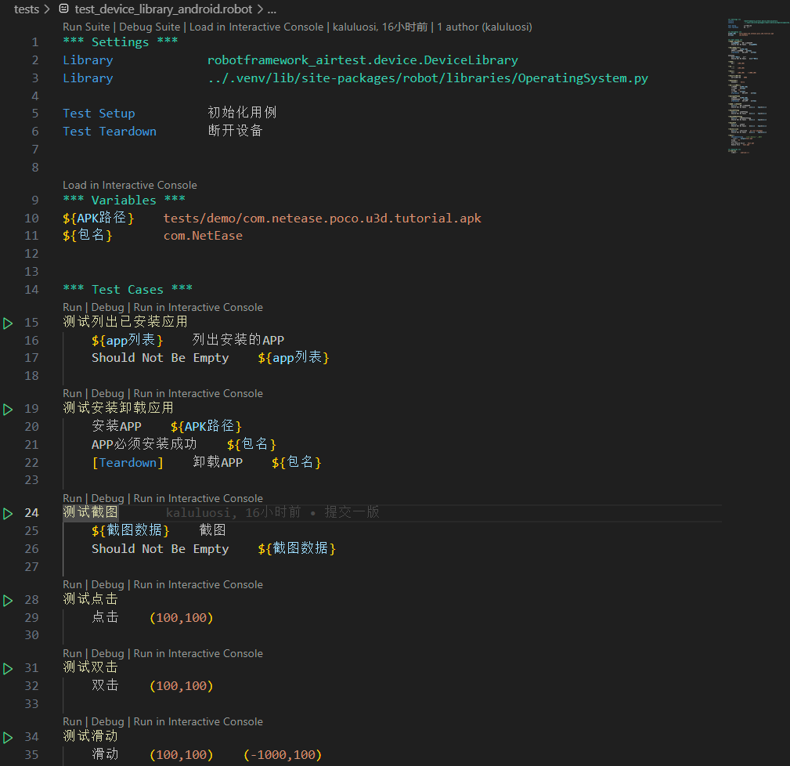
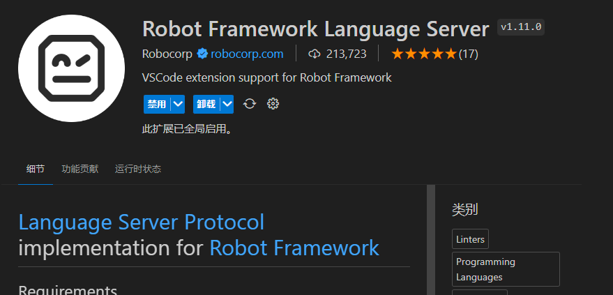

# 安装

## Python 版本要求

Python 3.8~3.9

由于 Airtest/pocoui 包只支持3.8~3.9，超过3.9就会报错无法兼容，因此建议使用3.8~3.9版本。

如果你工作中面临不同项目不同Python版本问题，建议你使用 `pyenv` 来下载和管理Python版本（比官方的luanch方案好用多了）。

## 安装 Robotframework-Airtest

```shell
pip install robotframework-airtest
```

!!! note 
    由于`robotframework-airtest` 本身就依赖了 `robotframework` 所以不用再安装 `robotframework`了。

命令行中敲下面代码，如果看到了CLI打印那么就安装成功。

```shell
> ra
Usage: ra [OPTIONS] COMMAND [ARGS]...

  ================================================================
  Airtest For Robot Framework
  ================================================================

Options:
  --help  Show this message and exit.

Commands:
  start  创建模板项目
  docs   打开文档
  vmg    界面模型导出工具
```

## IDE推荐使用VSCODE

VSCode有Robotframework插件支持，可以调试断点语法提示。


Robotframework插件：[robotframework-lsp](https://marketplace.visualstudio.com/items?itemName=robocorp.robotframework-lsp)


!!! warning
    PyCharm也有Robotframework插件，但是我的模板项目是以VSCode为IDE设计的，因此要在PyCharm上用我的模板项目你需要自己去修改。

