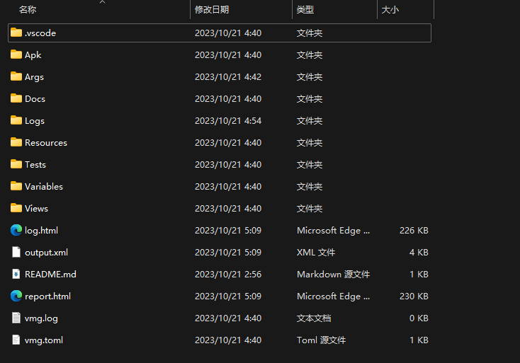
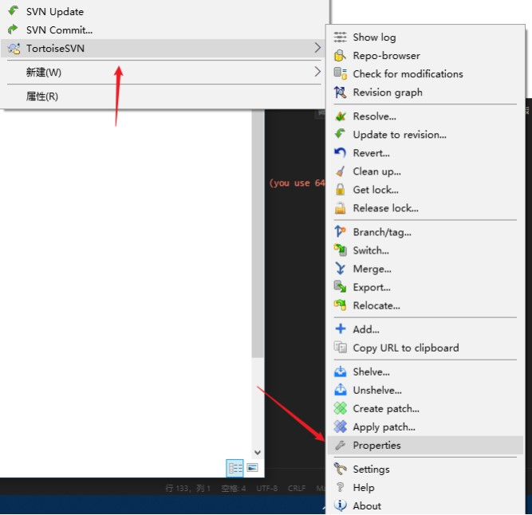
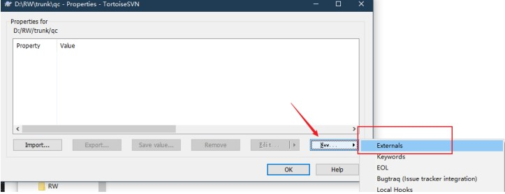

# 创建测试项目

这部分文档是给测试项目创建人看的，如果你的项目里已经有测试项目了你不需要看这部分。直接去看[开发环境配置](./2_dev_env.md)

## 通过项目想到创建项目 —— `ra start`

1. 新建一个目录
2. 打开命令行，`cd` 到这个目录里
3. 执行 `ra start` 命令

```shell
============================xr模板项目向导============================
>项目文件复制完毕
=========================vmg.toml配置文件向导=========================
>前端界面资源（prefab）所在目录 [Views]:
>前端界面资源文件格式，空格隔开 [.prefab]:
>界面模型导出后保存到 [Resources/界面模型]:
>选择导出器 (unity) [unity]:
>创建 vmg.toml 成功，以后要修改导出配置可以到这个文件中修改。
>模板项目创建完毕

```

生成后的项目



!!! Tip
    如果你项目使用版本控制工具，那么`.vscode/settings.json`需要添加到`ignore`去忽略提交。
    每一个测试工程师应该在自己本地配置自己的`.vscode/settings.json`，不要提交到版本控制里。


## 界面模型导出配置 `vmg.toml`

Robotframework-Airtest的一项重要特性就是面向界面模型测试，界面模型是从游戏前端项目的界面资源里解析导出生成的。
界面模型导出使用命令：

```shell
ra vmg
```
该命令默认会读取测试项目目录下的`vmg.toml`配置文件，然后根据配置导出界面模型。

### vmg.toml配置文件
打开`vmg.toml`
通过 `xr start` 项目向导创建的项目默认的界面模型导出工具（后面简称**vmg**）的配置如下：

```
[default]
source = "Views"
dist = "Resources/界面模型"
exts = [ ".prefab",]
generator = "unity"

```

!!! note 上面的配置意思是 
    **用Unity界面模型导出器，从`Views`目录 把所有的`.prefab`文件导出成`resource`保存到`Resources/界面模型`目录下面**。

这个配置也支持配置多个导出规则，毕竟前端不一定所有的界面资源都在一个目录下，可能有一些
比较特殊分散在别的目录。多导出规则示例如下：

```
[default]
source = "Views"
dist = "Resources/界面模型"
exts = [ ".prefab",]
generator = "unity"


[extra] # 这是我们新配置,名字可以随意，好认就行
source = "ExtraViews" # 测试项目下的ExtraViews是另一个包含界面资源的目录
dist = "Resources/界面模型/extra" # 导出到这里
exts = [ ".prefab"]
generator = "unity"

[<配置名>] 
# 你还可以继续添加
...
```


### 如何将前端的界面资源文件放到`Views`目录

##### 如果你的项目用的是SVN

我们可以通过SVN的**properies.external**属性将前端项目的界面资源目录软链接到`Views`目录下。




##### 如果你的项目用的是Git

你可以使用`submodule`

```shell
git submodule add <url-to-another-repo/views> Views
```

##### 你可以可是使用软连接

Windows软连接

```shell
mklink /D <url-to-another-repo/views> Views
```

Linux的软连接
```shell
ln -s <url-to-another-repo/views> Views
```

!!! warning
    不建议用软连接来将前端界面资源文件放到`Views`目录，因为软连接只是本地有效，其他的测试同事检出项目后都要自己再设置一边，而且无法被版本控制。


### 测试界面模型导出

在测试项目根目录下调出控制台（又或者你在VSCode的终端命令行里操作），然后输入一下命令：

```shell
ra vmg gen
```
看到导出日志那么就成功导出界面模型了。
```shell
>ra vmg gen
===========================开始根据配置文件导出===========================
>开始处理 default:
vmg-INFO:解析 Views\BagView.prefab
vmg-INFO:导出Views\BagView.prefab-->Resources/界面模型\BagView.resource
vmg-INFO:解析 Views\subview\BagView.prefab
vmg-INFO:导出Views\subview\BagView.prefab-->Resources/界面模型\subview\BagView.resource
...
```

你的测试项目已经搭建完成，接下来就是要学习怎么用写用例了。
