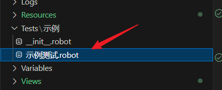
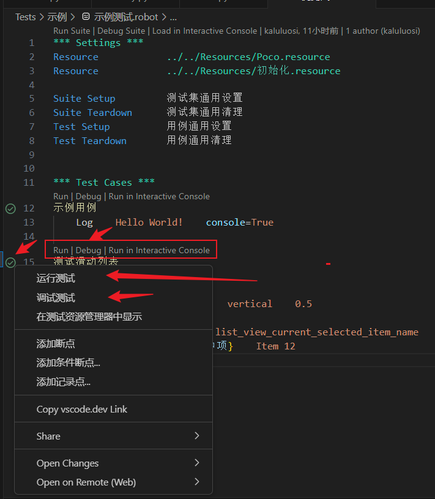
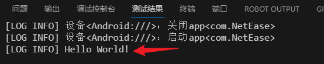
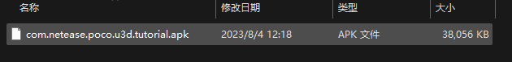
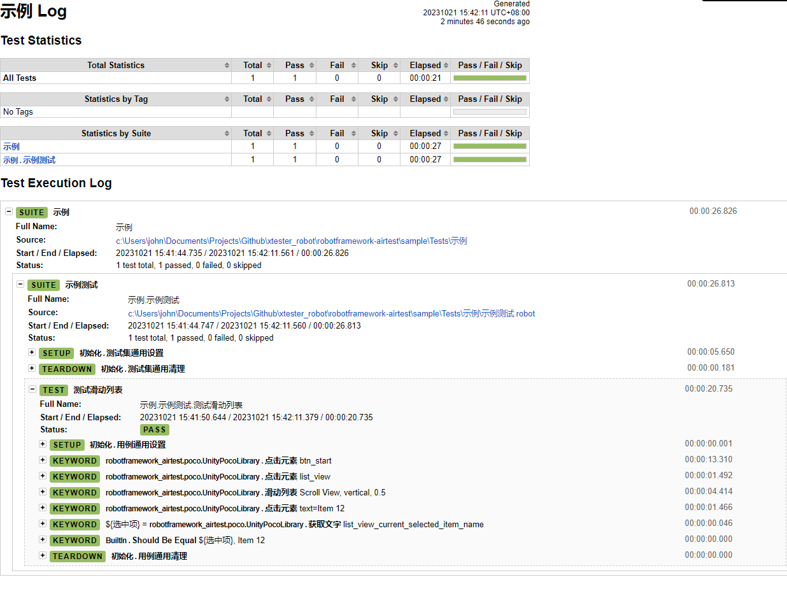
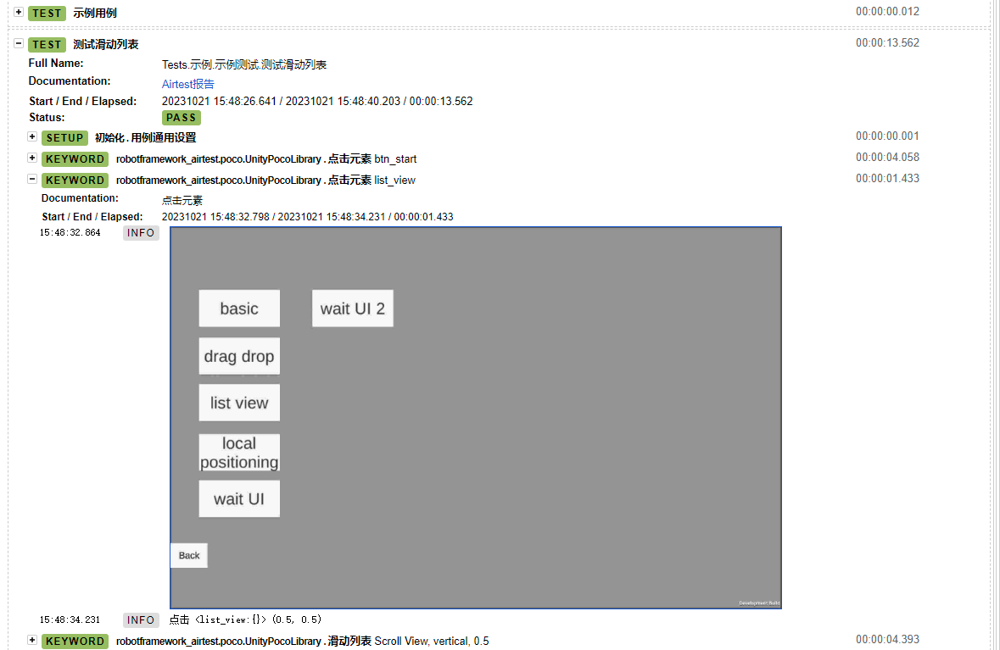
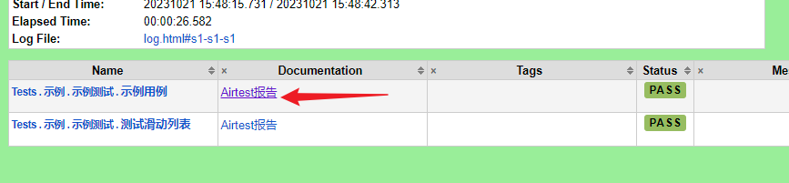

# 配置本地开发环境

## 本地调试环境设置

复制`.vscode\settings.json.sample`到`.vscode\settings.json`。
设置`robot.variables`。

!!! Tip:
    `ra` 生成项目的时候已经默认设置了，你只需要按实际情况微调。

```json
{
    "robot.variables": {
        "device_uri":"Windows:///?title_re=com", //PC客户端这个配置，连接windows客户端
        //"device_uri":"Unity:///", // UnityEditor用这个配置，连接UnityEditor。
        //"device_uri":"Android:///", // 连接安卓手机
        "pkg_name":"<PC客户端exe路径>", 
        //"pkg_name":""  // Unity用这个配置，留空即可，Unity需要保持Unity启动，并且如果多个Unity同时运行会识别不了
        "serverid":"1",  // 自动登录服务器id
        "auto_start_app": "True",   // 自动打开游戏
        "language": "zh"  // 用作多语言表的切换
    },
    "python.envFile": "${workspaceFolder}/.env" //这个不用修改
}

```

!!! Warning
    设置好后要将所有注释去掉！不然调试的时候会报错。

## 下面分别介绍这些参数：

!!! Tip
    以下这些参数在Robot脚本中都会作为全局变量。也就是说你可以在Robot脚本里直接用`${device_uri}`访问到`.vscode\settings.json`中的这几个参数。

    同理，也可以在Robot命令中覆盖这几个参数。
    ```shell
    robot --variable device_uri:Android:/// --variable pkg_name:com.NetEase ...
    ```
    
    这样就可以做到开发环境和实际测试环境独立区分开来。

**device_uri**

设备连接符，用于连接控制设备。设备连接用的就是Airtest的设备连接方案，所以这块是一样的，具体可见其文档[Airtest设备连接字符串](https://airtest.doc.io.netease.com/tutorial/4_Android_automated_testing_one/#_5)怎么编写。语法：

```
<平台名>://UUID/[?[查询语句[&查询语句]...]]

例子：
Android://HOIE67832
```

我们在PC上调试只需要用到以下两种就可以了：

PC端

```
Windows:///?title_re=<窗口标题>

```
!!! Tip
    `title_re` 这个查询参数是 用正则表达式去匹配窗口标题。

UnityEditor因为情况比较特殊，所以特别实现了它专用连接符。
```
Unity:///
```

想要连接真机就要去看Airtest设备连接了解怎么写Android设备的连接字符串。 

!!! Tip
    device_uri 跟 [Airtest设备连接字符串](https://airtest.doc.io.netease.com/tutorial/4_Android_automated_testing_one/#_5) 是一致的，毕竟也是基于Airtest开发的。
    除了Unity额外实现了个专用的连接串。

!!! Warning
    Unity设备的连接不支持同时连两个Unity。


**pkg_name**

包名，不同的设备类型下有不一样的行为。

|连接设备类型|值说明|
|---|---|
|Windows|游戏客户端的启动文件，exe或者bat|
|Unity|空字符即可|
|Android|APP包标志名 例如：com.xy.xyx|
|IOS|跟Android一样包标志名|

**serverid**

测试服务器id，用来供`自动创角`关键字使用。

!!! Note
    `自动创角`关键字位于`Resources\辅助.resource`。

**auto_start_app**

是否测试的时候自动打开游戏， 如果不想每次调试脚本都重启游戏可以设置为"False"
在不同的设备上有不同的表现：

|设备|表现|
|---|---|
|Windows|运行游戏exe|
|Unity|用Play的快捷键运行游戏，**不会帮你打开Unity的，你的先开着**|
|Android|运行游戏app|
|ios|运行游戏app|

**language**

导入多语言变量文件，值对应`Resources\Language`目录下的文件。

由于我们测试的时候不可避免的需要一些文本变量，比如点击某个文本为"开始"的按钮，一旦多语言开发的时候这个按钮的文本就是"Start"了。我们不写死文本，而是用变量文件来管理这些文本，我们引用变量的方式，那么只需要切换不同的变量文件就可以做到文本切换。

!!! note
    `language`不是必须的，是属于可选方案。


设置好后就开始我们第一个测试脚本。

------------------------------

## 运行第一个脚本


打开`Tests/示例/示例测试.robot`





你有多种途径可以单独运行/调试测试，随便用一种方式运行**示例用例**看看。



测试结果打印`Hello World`表示执行成功。

## 试一下用Poco来测试Airtest的Demo应用

首先到`Apk`目录将`com.netease.poco.u3d.tutorial.apk`安装到手机。


手机adb连接到电脑。

接着再试一下执行**测试滑动列表**。

```shell
==============================================================================
示例
==============================================================================
DeviceLibrary初始化 device_uri:Android:/// pkg_name:com.NetEase auto_start_app:True
示例.示例测试
==============================================================================
执行 初始化.测试集通用设置 []
执行 robotframework_airtest.device.DeviceLibrary.连接设备 []
连接设备： device_uri=Android:/// pkg_name=com.NetEase auto_start_app=True
设备<Android:///>：连接
启动APP：True
连接设备成功
执行 BuiltIn.No Operation []
测试滑动列表                                                          PocoLibrary 设置截图目录 C:\Users\john\Documents\Projects\Github\xtester_robot\robotframework-airtest\sample\.airtest\robot_snap       
执行 初始化.用例通用设置 []
执行 BuiltIn.No Operation []
.执行 robotframework_airtest.poco.UnityPocoLibrary.点击元素 ['btn_start']
创建Poco实例
尝试创建Poco...
[WinError 10054] 远程主机强迫关闭了一个现有的连接。
Poco连接失败，可能游戏还没有加载完...
尝试重新连接.... 1/10
尝试创建Poco...
[WinError 10054] 远程主机强迫关闭了一个现有的连接。
Poco连接失败，可能游戏还没有加载完...
尝试重新连接.... 2/10
尝试创建Poco...
[WinError 10053] 你的主机中的软件中止了一个已建立的连接。
Poco连接失败，可能游戏还没有加载完...
尝试重新连接.... 3/10
尝试创建Poco...
[WinError 10054] 远程主机强迫关闭了一个现有的连接。
Poco连接失败，可能游戏还没有加载完...
尝试重新连接.... 4/10
尝试创建Poco...
Poco实例创建完毕
.执行 robotframework_airtest.poco.UnityPocoLibrary.点击元素 ['list_view']
.执行 robotframework_airtest.poco.UnityPocoLibrary.滑动列表 ['Scroll View', 'vertical', '0.5']
.执行 robotframework_airtest.poco.UnityPocoLibrary.点击元素 ['text=Item 12']
.执行 robotframework_airtest.poco.UnityPocoLibrary.获取文字 ['list_view_current_selected_item_name']
.执行 BuiltIn.Should Be Equal ['${选中项}', 'Item 12']
.执行 初始化.用例通用清理 []
执行 BuiltIn.No Operation []
测试滑动列表                                                  | PASS |
------------------------------------------------------------------------------
执行 初始化.测试集通用清理 []
执行 robotframework_airtest.device.DeviceLibrary.断开设备 []
示例.示例测试                                                         | PASS |
1 test, 1 passed, 0 failed
==============================================================================
示例                                                                  | PASS |
1 test, 1 passed, 0 failed
==============================================================================
Output:  C:\Users\...\robotframework-airtest\sample\output.xml
Log:     C:\Users\...\robotframework-airtest\sample\log.html
Report:  C:\Users\...\robotframework-airtest\sample\report.html
```

最后三行是测试日志和报告，你可以点开 `C:\Users\...\robotframework-airtest\sample\report.html` 来看看生成的测试报告。



每个操作都有截图


## 用命令行来执行测试

将来自动化测试终归是要集成到CI\CD里执行，我们需要用命令行来执行所有测试而不是在VSCode里执行。

### 本地执行

本地执行所有测试可以使用根目录的`run.bat`。

```bat
.\run.bat
```

命令执行

```shell
robot -A Args/run.args Tests
```

!!! Tip
    `-A Args/run.args` 其实是读取`run.args`文件里的命令行参数作用到`robot`命令中。这样做可以将常用的参数组合放到一个文件里编辑管理，缩短命令长度。
    如果不用这种方式那么就像下面：
    ```shell
    robot -L  TRACE:DEBUG -i  DEBUG  -e  SKIP --variable   LANGUAGE:zh --variablefile  Args/config.py --listener robotframework_airtest.reporter.AirtestReporter:True --reporttitle   调试测试报告 --splitlog
    ```

!!! Note
    **`--listener robotframework_airtest.reporter.AirtestReporter:True ` 的作用是生成Airtest报告并嵌入到Robot Framework的报告中去。**

     

    点击**Airtest报告**会跳转到Airtest原生报告页面。

    VSCode中调试Robot用例不会添加这个参数，所以调试生成的报告没有Airtest报告。


### CD\CD Jenkins上执行

采用命令执行

```shell
robot -A Args/run.args --variable device_uri:$DEVICE_URI --variable pkg_name:$PKG_NAME --variable language:$LANG Tests
```

!!! Note
    上面的$变量是Jenkins的Job编辑传入的，通过`--variable`参数来覆盖`run.args`里的值。


